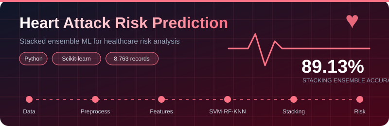
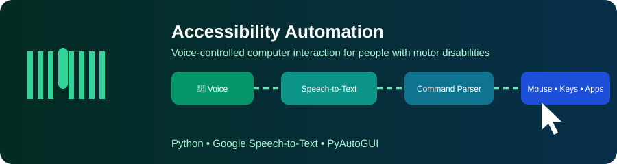

<div align="center">




<br>

<a href="https://github.com/AlwinJCOde667"></a>
<a href="https://www.linkedin.com/in/YOUR-LINKEDIN"></a>

<br><br>

</div>


## 👨‍💻 About Me


I'm a **Computer Science Engineering student** who loves taking an idea from
**concept → model → application → working prototype**.

```python
class AlwinJohn:
    role    = "CSE Student • AI/ML Developer"
    focus   = ["Machine Learning", "Computer Vision", "Accessibility Tech"]
    mission = "Build software that actually helps people"
    status  = "Always learning, always shipping 🚀"
```

<br clear="right"/>

<table>
<tr>
<td width="50%" valign="top">

**🤖 Artificial Intelligence**
- Machine Learning
- Predictive Analytics
- Computer Vision
- Intelligent Systems

</td>
<td width="50%" valign="top">

**💻 Software**
- Application Development
- Web Development
- Automation
- Accessibility Technology

</td>
</tr>
</table>


## 🚀 Featured Projects

<!-- ============ PROJECT 1 ============ -->
### ❤️ Advanced Heart Attack Risk Prediction



<div align="center">

</div>

<br>

> **What it does:** A healthcare machine-learning system that analyzes patient and lifestyle features to estimate a person's **heart attack risk**. Multiple classifiers were trained and compared, then combined into a **stacked ensemble** (SVM, Random Forest, KNN) that beat every individual model.

<table>
<tr>
<td width="33%" valign="top" align="center">

**📂 Data**<br>
8,763 records of patient & lifestyle features

</td>
<td width="33%" valign="top" align="center">

**🧪 Models**<br>
8 algorithms benchmarked head-to-head

</td>
<td width="33%" valign="top" align="center">

**🏆 Result**<br>
89.13% with the stacking ensemble

</td>
</tr>
</table>

<details>
<summary><b>📈 Full model comparison (click to expand)</b></summary>

<br>

| Model | Accuracy | |
|---|---|---|
| Decision Tree | 79.35% | ▰▰▰▰▰▰▰▱▱▱ |
| Naive Bayes | 83.70% | ▰▰▰▰▰▰▰▰▱▱ |
| Logistic Regression | 84.24% | ▰▰▰▰▰▰▰▰▱▱ |
| KNN | 84.78% | ▰▰▰▰▰▰▰▰▱▱ |
| SVM | 86.96% | ▰▰▰▰▰▰▰▰▰▱ |
| Random Forest | 88.04% | ▰▰▰▰▰▰▰▰▰▱ |
| Voting Ensemble | 88.59% | ▰▰▰▰▰▰▰▰▰▱ |
| **Stacking Ensemble** | **89.13%** | ▰▰▰▰▰▰▰▰▰▰ 🏆 |

</details>

   


<!-- ============ PROJECT 2 ============ -->
### 🧠 Postpartum Depression Detection


<div align="center">

</div>

<br>

> **What it does:** A research-oriented machine-learning project that explores whether **postpartum depression** can be detected early from **socio-demographic and psychosocial survey data**. The goal is to turn survey responses into a reliable risk signal that could help flag mothers who may need support.

<table>
<tr>
<td width="25%" valign="top" align="center">

**🧹 Clean**<br>
Handle missing and inconsistent survey responses

</td>
<td width="25%" valign="top" align="center">

**🛠️ Engineer**<br>
Build meaningful features from raw answers

</td>
<td width="25%" valign="top" align="center">

**🤖 Classify**<br>
Train ML models to separate risk levels

</td>
<td width="25%" valign="top" align="center">

**🚦 Predict**<br>
Output a risk classification per respondent

</td>
</tr>
</table>

   


<!-- ============ PROJECT 3 ============ -->
### ♿ Accessibility Automation



<div align="center">

</div>

<br>

> **What it does:** A voice-based computer interaction system designed for people with **motor disabilities**. Speech is captured and converted with **Google Speech-to-Text**, parsed into commands, and then used to drive the **mouse, keyboard and applications**, so a computer can be used completely hands-free.

<table>
<tr>
<td width="25%" valign="top" align="center">

**🎤 Listen**<br>
Capture the user's voice

</td>
<td width="25%" valign="top" align="center">

**📝 Transcribe**<br>
Google Speech-to-Text

</td>
<td width="25%" valign="top" align="center">

**🧩 Parse**<br>
Turn text into commands

</td>
<td width="25%" valign="top" align="center">

**🖱️ Act**<br>
Mouse, keyboard & app control

</td>
</tr>
</table>

  


## 🧰 Tech Universe

<div align="center">



<br>


</div>


## 📊 GitHub Analytics

<div align="center">


<br>


</div>


## 🐍 Contribution Snake

<div align="center">
<picture>
  <source media="(prefers-color-scheme: dark)" srcset="https://raw.githubusercontent.com/AlwinJCOde667/AlwinJCOde667/output/github-contribution-grid-snake-dark.svg">
  
</picture>
</div>


## 🎵 Now Playing

<div align="center">

<!-- Setup: deploy novatorem (github.com/novatorem/novatorem) to Vercel with your Spotify keys, then replace the URL below. -->
<a href="https://open.spotify.com/user/YOUR_SPOTIFY_ID">
  
</a>

</div>


## 🎮 Play With My Profile

### ♟️ Chess (by [@timburgan](https://github.com/timburgan))
Click a move link to open an issue; a GitHub Action plays it.
Setup: copy the workflow + `chess_images` from [timburgan/timburgan](https://github.com/timburgan/timburgan), then paste the board section it generates here.

### 🔴🟡 Connect 4 (community game by [@jonathangin52](https://github.com/jonathangin52))
Setup: copy the Connect 4 workflow from [@jonathangin52's profile repo](https://github.com/jonathangin52/jonathangin52) into `.github/workflows/` and keep the board markers it asks for.

### 🟩 Game of Life (by [@ethomson](https://github.com/ethomson))
Built with the [contributions](https://www.npmjs.com/package/contributions) and [dat-life](https://www.npmjs.com/package/dat-life) packages. See [how it works](https://github.com/ethomson#how-does-it-work).

<div align="center">
<!-- After setting up the workflow, it will write the animated board here -->

</div>


## 📝 Latest Activity (self-updating)

Inspired by [@simonw](https://simonwillison.net/2020/Jul/10/self-updating-profile-readme/). A GitHub Action rewrites the list below.

<!-- BLOG-POST-LIST:START -->
<!-- BLOG-POST-LIST:END -->

<!-- RECENT-ACTIVITY:START -->
<!-- RECENT-ACTIVITY:END -->


<div align="center">

### 🦘 Thanks for stopping by


### 🌐 Let's Connect
Have an idea? Let's build it. 🚀


<br>


</div>
